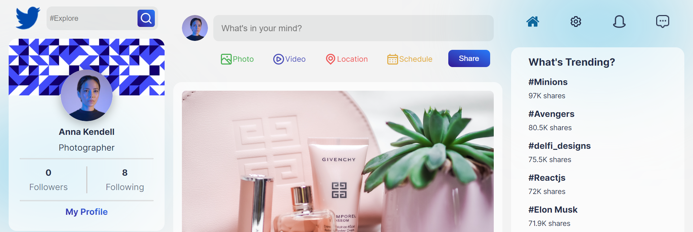
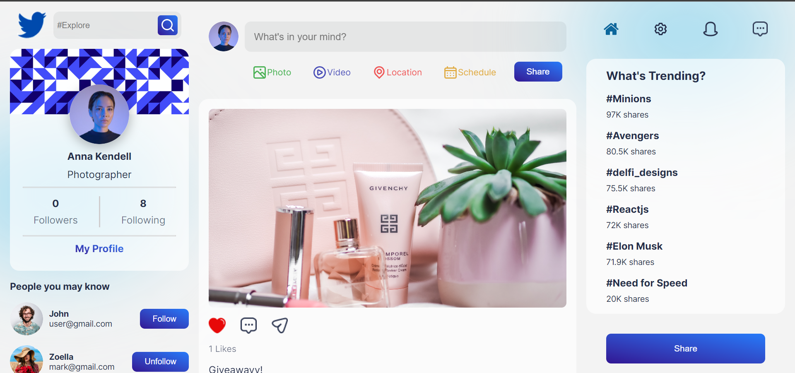

<h1 align=center>

</h1>

<div align="center">

 


</div>

# FriendsBook : Social Media Platform
## Index

- [About](#about)
- [Demo](#demo)
- [Built with](#technologies)
- [Preview](#preview)
- [Features](#features)
- [Run Locally](#local)
- [Feedback](#feedback)


<a id='about'/>

 ## :information_source: About

FriendsBook is the Modern UX/UI  Social media site with: <br/>

- User Authentication
- CRUD operation for User
- Fetching timeline posts according to particular user followings & time
- Likes and Dislike Functionalities
- CRUD operation on post 
- Request Handling
- Complex Mongodb queries
- Serverside Routing


This project was bootstrapped using [create-react-app](https://reactjs.org/docs/create-a-new-react-app.html)


<a id='demo'/>

## :link: Demo

[Click to see Live Demo](#_)


<a id='technologies'/>

## :hammer: Built With

This project was developed using the following technologies:

### **Frontend** <sub><sup>React</sup></sub>
  - [React](https://reactjs.org/)
  - [CSS](https://www.w3schools.com/css/)
  - [Axios](https://axios-http.com/docs/intro)
  - [ReactDOM](https://reactjs.org/docs/react-dom.html)
  - [Redux](https://react-redux.js.org/)
  - [Redux Thunk](https://redux.js.org/usage/writing-logic-thunks)


  ### **Backend** <sub><sup>mongodb+express+node</sup></sub>

  - [Mongodb](https://www.mongodb.com/)
  - [Express](https://expressjs.com/)
  - [Node](https://nodejs.org/en/)
  - [Bcrypt](https://www.npmjs.com/package/bcrypt)
  - [Body Parser](https://www.npmjs.com/package/body-parser)
  - [Cors](https://www.npmjs.com/package/cors)
  - [dotenv](https://www.npmjs.com/package/dotenv)
  - [Nodemon](https://www.npmjs.com/package/nodemon)
  - [Multer](https://www.npmjs.com/package/multer)
  - [Mongoose](https://mongoosejs.com/)
  

<a id='features'/>

## :fire: Salient Features

- Request Handling
- Complex Mongodb queries
- Serverside Routing
- Use of Modern UX and UI
- Tuned Multiple complex Gradients
- soft and smooth animations
- Reusable react functional components
- Proper file and folder architecture 
- Fully Responsive along all devices 
- Cross platform

<a id='preview'/>

## :framed_picture: Preview

Check out how it looks:




<a id='local'/>

## :computer: Run Locally

Clone the project

```bash
  git clone https://github.com/clair-daisies/social-media-app.git
```

Go to the project directory

```bash
  cd social-media-app
```

Install dependencies

```bash
  social-media-app/frontend
  yarn install

  social-media-app/backend
  npm install

  
```

Spin up the server

```bash
   cd social-media-app/backend
   npm start

   cd social-media-app/frontend
   yarn start
```

<a id='feedback'/>

## :love_letter: Feedback

If you have any feedback, please reach out to me at 

<p align="center">
<br/>
  Made with :coffee: and ❤️ by <b>delfina</b>.
<p/>